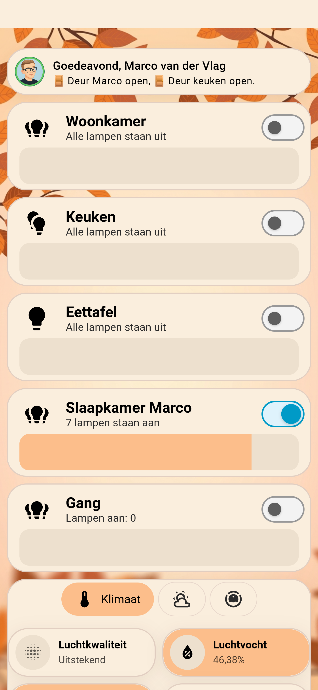
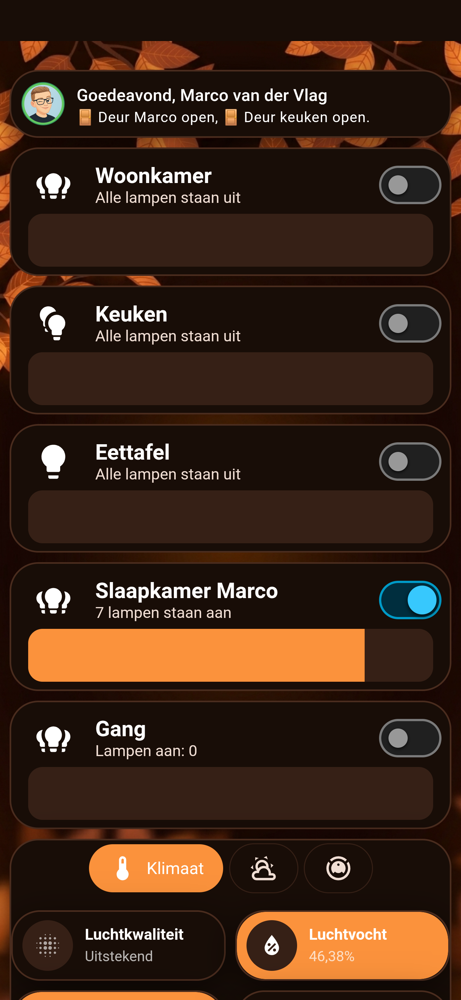
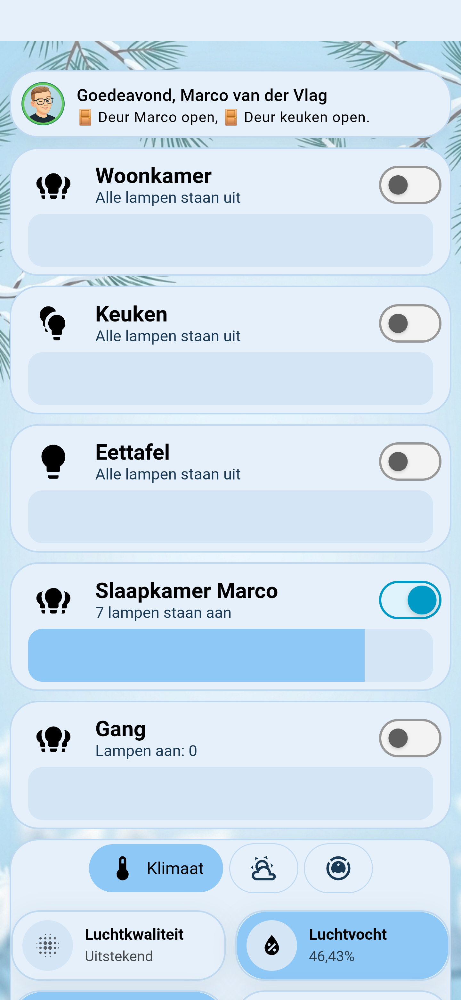
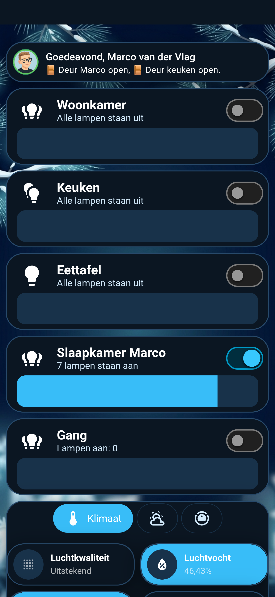
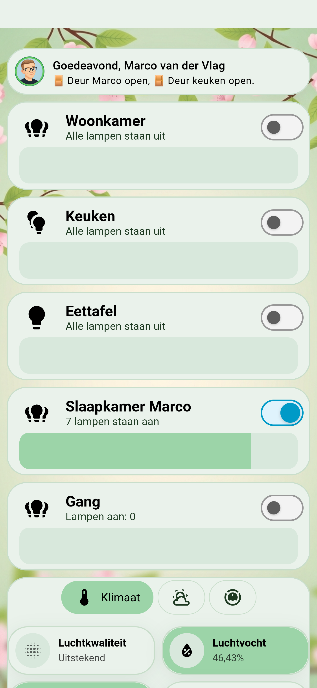
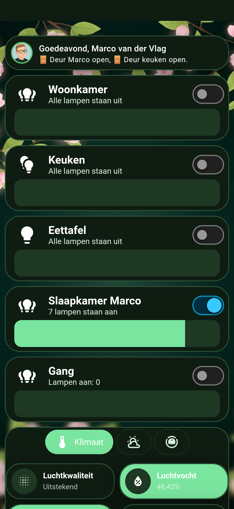
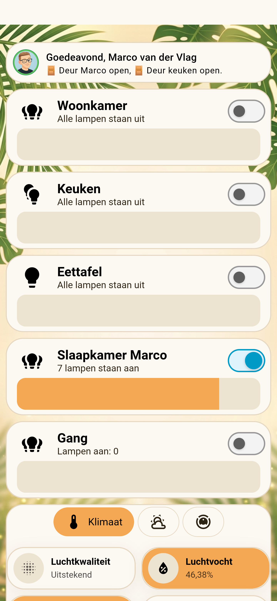
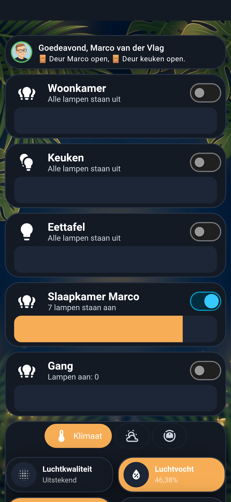

# 🌸🍂 Material You Seasonal Theme for Home Assistant ❄️☀️

<div align="center">

[](https://github.com/hacs/default)
[](https://www.home-assistant.io/)
[](https://opensource.org/licenses/MIT)

**A high-end, adaptive Material You (Material Design 3) seasonal theme for Home Assistant with full light & dark mode support, native Web Awesome tokens, modern pill navigation, and deep card integrations.**

[📸 Seasonal Showcase](#-seasonal-showcase) • [🎨 Highlights](#-highlights) • [📦 Installation](#-installation) • [⚙️ Automations](#%EF%B8%8F-seasonal-automations) • [🍄 Card Integrations](#-card-integrations)

</div>

---

## 📸 Seasonal Showcase

<div align="center">

### 🍂 Herfst (Autumn)
*Warm Terracotta & Soft Peach in Light Mode • Rich Cocoa & Glowing Amber in Dark Mode*

| Light Mode | Dark Mode |
| :---: | :---: |
|  |  |

---

### ❄️ Winter (Winter)
*Crisp Frost & Pastel Sky in Light Mode • Midnight Arctic & Vivid Cyan in Dark Mode*

| Light Mode | Dark Mode |
| :---: | :---: |
|  |  |

---

### 🌸 Lente (Spring)
*Fresh Botanical & Soft Sage in Light Mode • Deep Emerald & Radiant Mint in Dark Mode*

| Light Mode | Dark Mode |
| :---: | :---: |
|  |  |

---

### 🌴 Zomer (Summer)
*Mediterranean Sand & Warm Honey in Light Mode • Deep Midnight & Sunset Gold in Dark Mode*

| Light Mode | Dark Mode |
| :---: | :---: |
|  |  |

</div>

---

## 🌟 Highlights

* 🎨 **4 Harmonious Seasons:** Spring, Autumn, Winter, and Summer — each meticulously tuned with high-contrast Light and Dark palettes.
* 🔘 **Material You 3 Pill Navigation:** Sleek capsule indicators for the Home Assistant sidebar, action chips, and navigation buttons.
* 🍄 **Card Ecosystem Optimized:** Seamless out-of-the-box styling for Bubble Cards, Mushroom Cards, Hue-like Light Cards, and standard HA cards.
* ⚡ **100% Native Styling:** Zero mandatory JavaScript companion scripts required. Fully driven by Home Assistant’s CSS variable engine and `card-mod`.
* 🛡️ **Web Awesome Ready:** Complete native coverage for modern HA settings, integration badges, and Floating Action Buttons (`<ha-fab>`).

---

## 🍂 The 4 Seasons Overview

| Season | Light Mode Accent | Dark Mode Accent | Atmosphere |
| :--- | :--- | :--- | :--- |
| **🍂 Herfst (Autumn)** | Soft Peach (`#fcbe8b`) | Glowing Amber (`#fb923c`) | Warm Terracotta, Rich Cocoa & Amber Glow |
| **❄️ Winter (Winter)** | Pastel Sky (`#8ec8f6`) | Vivid Sky Blue (`#38bdf8`) | Crisp Frost, Glacier Clean & Midnight Arctic |
| **🌸 Lente (Spring)** | Soft Sage (`#9cd4a8`) | Fresh Mint (`#7ae59f`) | Fresh Botanical, Meadow Breeze & Emerald Forest |
| **🌴 Zomer (Summer)** | Warm Honey (`#f4a853`) | Radiant Gold (`#f6ad55`) | Mediterranean Sand & Deep Twilight Sunset |

---

## 📦 Installation

### Option 1: Via HACS (Recommended)

1. Open **HACS** in your Home Assistant.
2. Click on the **3 dots (⋮)** in the top right corner and select **Custom repositories**.
3. Paste the URL of this repository:
   ```text
   https://github.com/YOUR_GITHUB_USERNAME/material-you-seasonal-theme
   ```
4. Set the category to **Theme** and click **Add**.
5. Find **Material You Seasonal Theme** in HACS, click **Download**, and restart Home Assistant.

---

### Option 2: Manual Installation

1. Ensure your `configuration.yaml` includes:
   ```yaml
   frontend:
     themes: !include_dir_merge_named themes
   ```
2. Create a folder `/config/themes/material_you_seasonal/` in your Home Assistant configuration directory.
3. Download [`material_you_seasonal.yaml`](themes/material_you_seasonal/material_you_seasonal.yaml) and place it inside:
   ```text
   /config/themes/material_you_seasonal/material_you_seasonal.yaml
   ```
4. Go to **Developer Tools ➔ Services** and run `frontend.reload_themes` (or restart Home Assistant).

---

## ⚙️ Seasonal Automations

### 1. 🔄 Automatic Switching via Browser Mod & Season Integration
With **Browser Mod** and the built-in **Season** integration (`sensor.seizoen`), you can automatically change the theme and light/dark preference per user or per device:

```yaml
alias: "Seizoen Thema Aanpassing (Browser Mod)"
description: "Past het dashboard thema automatisch aan op basis van het huidige seizoen."
triggers:
  - trigger: state
    entity_id: sensor.seizoen
conditions: []
actions:
  - choose:
      # Zomer
      - conditions:
          - condition: state
            entity_id: sensor.seizoen
            state: summer
        sequence:
          - action: browser_mod.set_theme
            data:
              user_id:
                - person.marco_van_der_vlag
                - person.trientje
              theme: Material You Zomer
              dark: light

      # Herfst
      - conditions:
          - condition: state
            entity_id: sensor.seizoen
            state: autumn
        sequence:
          - action: browser_mod.set_theme
            data:
              user_id:
                - person.marco_van_der_vlag
                - person.trientje
              theme: Material You Herfst
              dark: light

      # Winter
      - conditions:
          - condition: state
            entity_id: sensor.seizoen
            state: winter
        sequence:
          - action: browser_mod.set_theme
            data:
              user_id:
                - person.marco_van_der_vlag
                - person.trientje
              theme: Material You Winter
              dark: dark

      # Lente
      - conditions:
          - condition: state
            entity_id: sensor.seizoen
            state: spring
        sequence:
          - action: browser_mod.set_theme
            data:
              user_id:
                - person.marco_van_der_vlag
                - person.trientje
              theme: Material You Lente
              dark: light
mode: single
```

---

### 2. 📅 Date-Based Global Theme Switcher
Alternatively, switch the theme globally across all devices on the first day of each season:

```yaml
alias: "Seasonal Theme Switcher (Global)"
trigger:
  - platform: time
    at: "00:01:00"
condition:
  - condition: template
    value_template: >-
      {{ (now().month in [3, 6, 9, 12]) and (now().day == 1) }}
action:
  - action: frontend.set_theme
    data:
      name: >-
        
        
          Material You Lente
        
          Material You Zomer
        
          Material You Herfst
        
          Material You Winter
        
```

---

## 🍄 Card Integrations

### 💬 Bubble Card
* Fully rounded $24\text{px}$ Material You corners on buttons, range sliders, and pop-up headers.
* Smooth seasonal color fill on active range sliders with zero border glitches.

### 💡 Hue-Like Light Card
* 100% solid, single-color card bodies without artificial gradient darkening on dimmed lights.
* Clean toggles that inherit the active seasonal color.

### 🔘 Navigation & Sidebar
* Pill-shaped navigation items with smooth hover transitions and high-contrast active state indicators.

---

## 📄 License
This project is open-source and licensed under the [MIT License](LICENSE).
